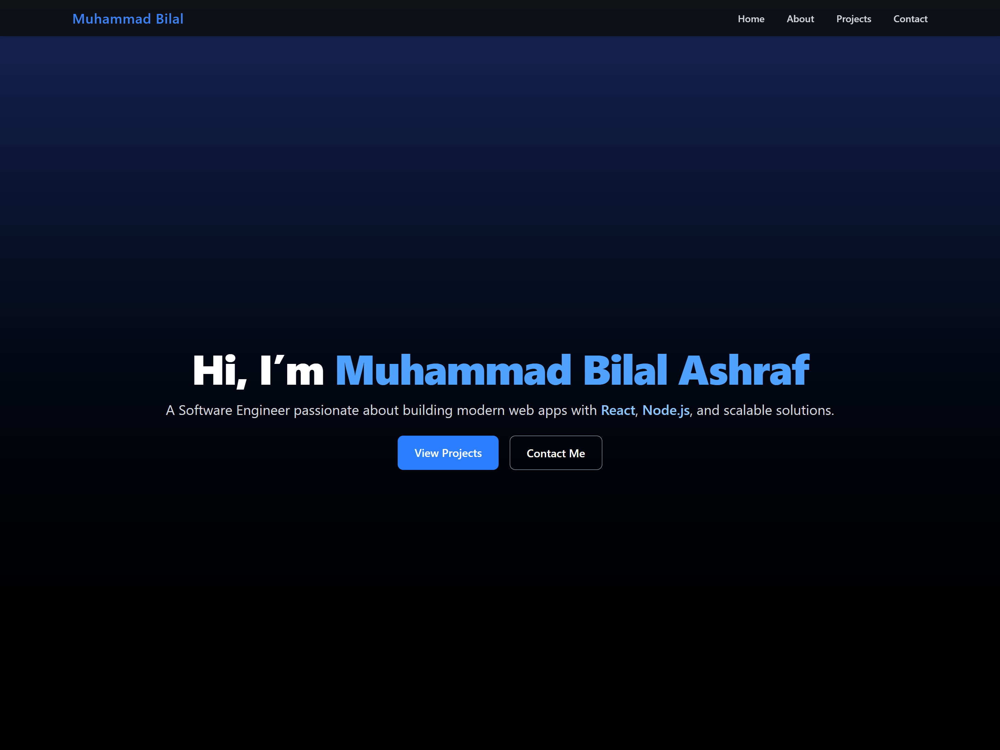
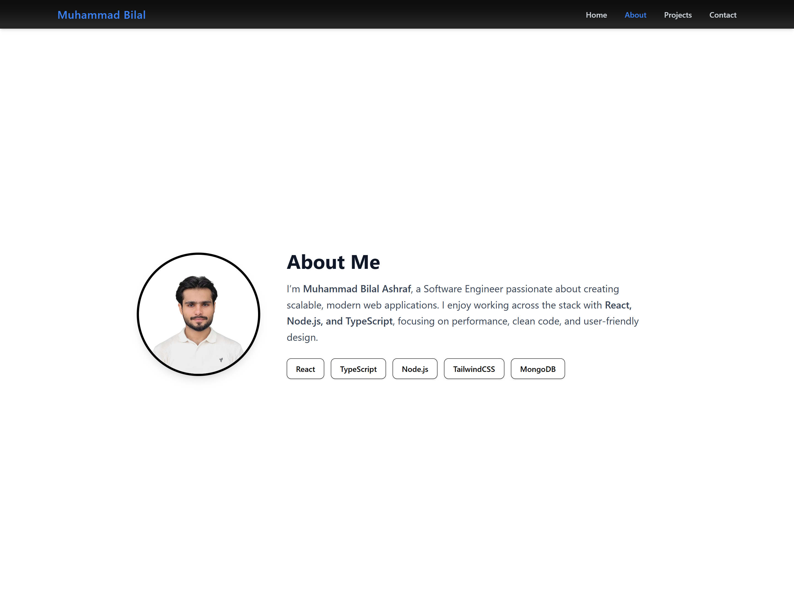
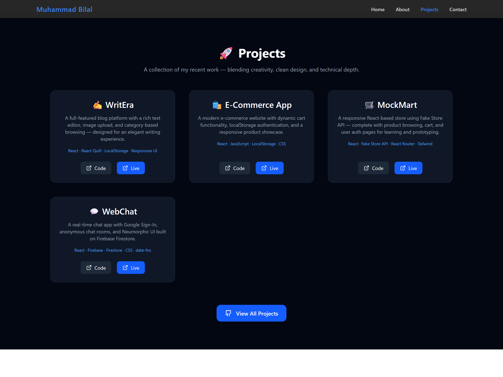
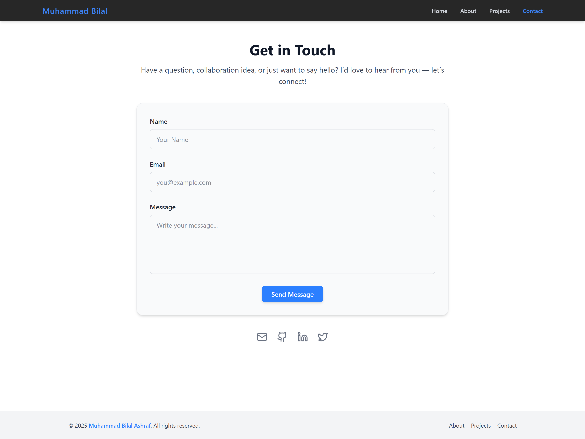

# 🚀 Muhammad Bilal Ashraf — Portfolio

Welcome to my personal developer portfolio!  
This project showcases my journey as a Software Engineer, featuring my best work, skills, and a bit about who I am. Built with **React**, **TypeScript**, **Vite**, and **TailwindCSS** for a blazing-fast, modern web experience.

---

## ✨ Features

- Responsive, accessible, and clean UI
- Animated sections and smooth navigation
- Project highlights with live demos and code links
- Contact form (powered by Formspree)
- Social links and more!

---

## 📸 Screenshots

> **Tip:** After deploying or running locally, take a screenshot of your app and place it in the `public/` or `src/assets/` folder.  
> Then, update the image path below!

| Home Page | About Section || Projects Section || Contact Section |
|-----------|---------------||------------------||-----------------|
|  |  | |  | |  |

---

## 🌐 Live Demo

Check out the live site here:  
👉 [https://your-vercel-app-url.vercel.app/](https://your-vercel-app-url.vercel.app/)

---

## 🛠️ Getting Started

1. **Install dependencies:**
   ```sh
   npm install
   ```
2. **Run locally:**
   ```sh
   npm run dev
   ```
3. **Build for production:**
   ```sh
   npm run build
   ```

---

## 📦 Tech Stack

- [React](https://react.dev/)
- [TypeScript](https://www.typescriptlang.org/)
- [Vite](https://vitejs.dev/)
- [TailwindCSS](https://tailwindcss.com/)
- [Framer Motion](https://www.framer.com/motion/)

---

## 🤝 Connect

- [GitHub](https://github.com/mrbilalashraf)
- [LinkedIn](https://linkedin.com/in/bilalashrafme)
- [Twitter](https://twitter.com/BilalAshrafme)

---

## 📝 License

MIT License

---

> Crafted with ❤️ by Muhammad Bilal Ashraf